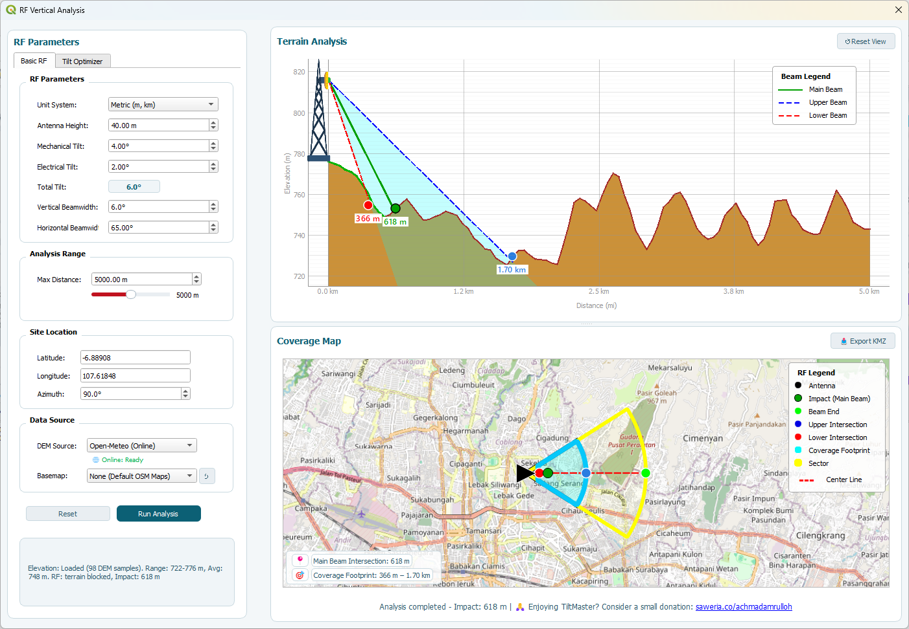
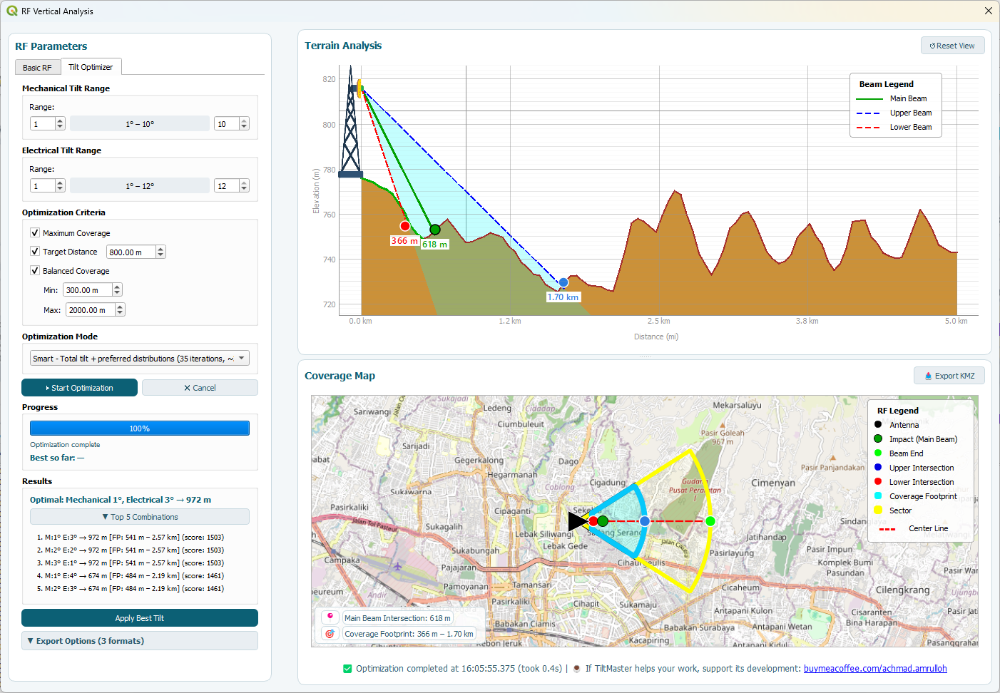

# TiltMaster - RF Vertical Analysis for QGIS

[](https://qgis.org)
[]()

Advanced RF planning toolkit for telecommunication engineers.  
Perform terrain-aware vertical beam analysis, intersection detection, coverage footprint estimation, and tilt optimization directly inside QGIS.


---

## 🚀 Features

### 📡 RF Vertical Analysis
- **Terrain Profile**: Visualize terrain elevation along antenna azimuth
- **Beam Geometry**: Calculate main, upper, and lower beam angles
- **Intersection Detection**: Detect where beams intersect terrain
- **Coverage Footprint**: Generate terrain-adjusted coverage area
- **Dual Unit Support**: Metric (m/km) and Imperial (ft/mi)

### ⚙️ Tilt Optimizer
- **3 Optimization Modes**:
  - **Precise**: Total tilt only (21 iterations)
  - **Smart**: Total tilt + top 5 distributions (~35 iterations)
  - **Fast**: Mechanical tilt only (11 iterations)
- **Multiple Criteria**:
  - Maximum coverage
  - Target distance
  - Balanced coverage range
- **Caching System**: Accelerates repeated calculations
- **Export Results**: CSV, Excel, JSON formats

### 🗺️ Visualization & GIS Integration
- Embedded QGIS map canvas with OSM basemap
- Terrain profile graph with beam visualization
- Draggable legends for map and profile
- Sector coverage visualization
- KMZ export for Google Earth

---

## 📸 Screenshots

### Basic RF Analysis


### Tilt Optimizer


---

## 📦 Installation

### From QGIS Plugin Repository.
1. Open QGIS
2. Go to `Plugins → Manage and Install Plugins`
3. Search for "TiltMaster"
4. Click Install

### Manual Installation
1. Download the latest release from GitHub  
   👉 https://github.com/erlrich/tiltmaster-qgis/releases
2. Extract to your QGIS plugins directory:
   - Windows: `C:\Users\YOUR_USERNAME\AppData\Roaming\QGIS\QGIS3\profiles\default\python\plugins\`
   - Linux: `~/.local/share/QGIS/QGIS3/profiles/default/python/plugins/`
   - macOS: `~/Library/Application Support/QGIS/QGIS3/profiles/default/python/plugins/`
3. Restart QGIS and enable the plugin in `Plugins → Manage and Install Plugins`

---

## ⚡ Quick Start Guide

### 1. Basic Analysis
1. Click the 📡 **TiltMaster** toolbar button
2. Enter site coordinates or use map center
3. Set antenna parameters (height, mechanical tilt, electrical tilt)
4. Choose DEM source (Local or Open-Meteo Online)
5. Click **Run Analysis**
6. View terrain profile and coverage map

### 2. Tilt Optimization
1. Switch to **Tilt Optimizer** tab
2. Set mechanical and electrical tilt ranges
3. Select optimization criteria
4. Choose optimization mode
5. Click **Start Optimization**
6. Review top 5 results and apply best tilt

### 3. Export Results
- **KMZ Export**: Save coverage footprint for Google Earth
- **CSV/Excel**: Export optimization results
- **JSON**: Export detailed analysis data

---

## ⚙️ Requirements

- QGIS 3.22 or higher
- Python 3.7+
- **PyQtGraph** (required for terrain visualization)
- Internet connection (optional, for online DEM source)

### Installing PyQtGraph

```bash
pip install pyqtgraph
```
---

## 🙏 Acknowledgement & Inspiration

This plugin was inspired by several RF engineering tools, including:

RF Universe Antenna Downtilt Calculator — Victor Perez

Kathrein Antenna Tilt Tool

TiltMaster is a QGIS-native implementation designed for terrain-aware RF vertical analysis, built entirely from scratch and optimized for GIS-based RF workflows.

---

## License

This project is licensed under the GNU General Public License v3.0 - see the [LICENSE](LICENSE) file for details.

This program is free software: you can redistribute it and/or modify it under the terms of the GNU General Public License as published by the Free Software Foundation, either version 3 of the License, or (at your option) any later version.

This program is distributed in the hope that it will be useful, but WITHOUT ANY WARRANTY; without even the implied warranty of MERCHANTABILITY or FITNESS FOR A PARTICULAR PURPOSE. See the GNU General Public License for more details.

You should have received a copy of the GNU General Public License along with this program. If not, see <https://www.gnu.org/licenses/>.

---

## Author

**Achmad Amrulloh**  
Email: achmad.amrulloh@gmail.com  
LinkedIn: [https://www.linkedin.com/in/achmad-amrulloh/](https://www.linkedin.com/in/achmad-amrulloh/)  
GitHub: [https://github.com/erlrich/tiltmaster-qgis](https://github.com/erlrich/tiltmaster-qgis)