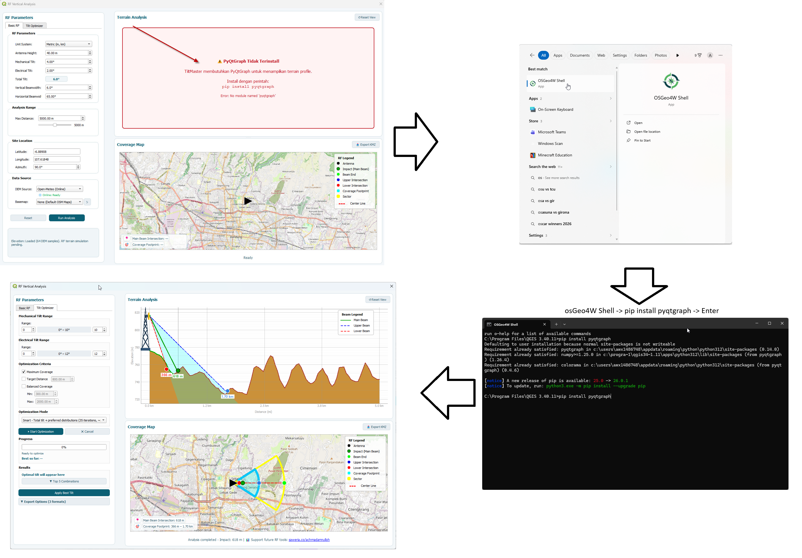

# TiltMaster - Troubleshooting Guide

## PyQtGraph Not Installed

### Symptoms
- Terrain profile widget shows error message
- "PyQtGraph Not Installed" appears in the analysis dialog
- Error: `No module named 'pyqtgraph'`

---

## Solution

Choose one of the following methods:

---

## Option 1: Install via OSGeo4W (Recommended for Windows)

### 1. Open OSGeo4W Shell
- Click Start Menu
- Search for **OSGeo4W Shell**
- Run as Administrator (right-click → Run as administrator)

### 2. Run installation command
```bash
osgeo4w-setup -k pyqtgraph
```

### 3. Follow the setup wizard
- Select **Install** or **Upgrade**
- Choose the **pyqtgraph** package
- Complete the installation

### 4. Restart QGIS

---

## Option 2: Using pip in OSGeo4W Shell

```bash
python -m pip install pyqtgraph
```

> 💡 **Screenshot Reference:**
> 
> *OSGeo4W Shell interface after running the command*

---

## Option 3: Manual Download

- Download: https://pypi.org/project/pyqtgraph/
- Extract the package
- Copy to:

```
C:\OSGeo4W\apps\Python39\Lib\site-packages\
```

---

## Verification

Run in QGIS Python Console:

```python
import pyqtgraph
print(pyqtgraph.__version__)
```

If version appears as below, installation successful.

```python
0.14.0
```

---

## Common Issues

### "pip is not recognized"
Use OSGeo4W Shell instead of CMD.

---

### "Access denied"
Run OSGeo4W Shell as Administrator.

---

### Package installed but still error
- Check multiple Python versions
- Restart QGIS completely
- Reinstall:
```bash
python -m pip install --force-reinstall pyqtgraph
```

---

## Other Common Issues

### DEM Layer Not Found
**Symptom:**  
`No DEM layer found in current project`

**Solution:**
- Load DEM raster (SRTM / ASTER)
- Ensure valid raster layer
- Use Open-Meteo (Online) if needed

---

### Basemap Not Loading
**Symptom:**  
Map blank / white

**Solution:**
- Check internet
- Change basemap
- Click refresh (↻)

---

### Export KMZ Failed
**Solution:**
- Ensure write permission
- Save to Desktop
- Avoid special characters

---

### No Elevation Data (0m)
**Solution:**
- Load valid DEM
- Check internet
- Verify coordinate coverage

---

## Getting Help

### Check Logs
- View → Panels → Log Messages
- Look for TiltMaster

---

### Report Issue
Include:
- OS version
- QGIS version
- Error messages
- Screenshot

Repo:
https://github.com/erlrich/tiltmaster-qgis

---

## Support Development

- https://buymeacoffee.com/achmad.amrulloh  
- https://saweria.co/achmadamrulloh  

---

_Last updated: April 2026_
